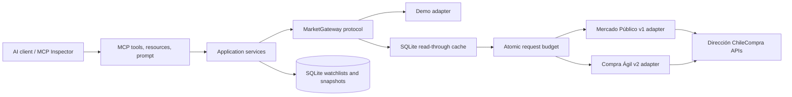

# ProcuraCL MCP

**Procurement intelligence for Chile, exposed as structured MCP tools.**

ProcuraCL helps an AI agent discover and monitor public-procurement opportunities without forcing
the user to understand the different contracts of Mercado Público v1 and Compra Ágil v2. It offers
a credential-free demo for evaluation and a ticket-backed live mode for real ChileCompra data.

> Independent portfolio project. ProcuraCL is not developed, endorsed, or supported by Dirección
> ChileCompra or Mercado Público. Demo records are synthetic and always return `source="demo"`.

## Product demo

The following run was captured from ProcuraCL `0.3.0` in MCP Inspector. A typed Compra Ágil search
finds an automation opportunity and preserves its buyer, dates, amount, region, source, and retrieval
time.


The same criteria can become a persistent watchlist. The first synchronization records one new
opportunity; a second identical synchronization records it as unchanged instead of creating a
duplicate.


The complete walkthrough is available in the [90-second demo script](docs/demo-script.md) and the
[evidence gallery](docs/demo-evidence.md).

## Why it is more than an API wrapper

- **One typed contract:** tenders and Compra Ágil records become a common `Opportunity` model.
- **Persistent monitoring:** SQLite stores watchlists, snapshots, sync runs, cache entries, and the
  local daily request budget.
- **Deterministic change detection:** the first observation is `new`, a changed fingerprint is
  `updated`, and an identical record is `unchanged`.
- **Production-safe boundaries:** secrets are environment-only, demo is the default, requests have a
  timeout, and every result carries provenance.
- **Resilient live integration:** Mercado Público v1 uses a typed community SDK while Compra Ágil v2
  is isolated behind a local anti-corruption client tested against the observed API contract.
- **Quota-aware reads:** cache hits do not consume the local budget; cache misses reserve one unit
  atomically before contacting ChileCompra.

## Architecture



The MCP interface does not contain business rules. Domain models, application use cases, external
adapters, and persistence remain replaceable and independently testable. See the full
[architecture](docs/architecture.md), [decision record](docs/decisions/ADR-001-mcp-as-interface.md),
and [threat model](docs/threat-model.md).

## MCP surface

| Capability | Tools |
| --- | --- |
| Discovery | `search_tenders`, `get_tender`, `search_agile_purchases`, `get_agile_purchase` |
| Market actors | `find_supplier`, `list_buyers` |
| Monitoring | `create_watchlist`, `list_watchlists`, `sync_watchlist`, `list_watchlist_changes`, `delete_watchlist` |
| Operations | `get_request_budget`, `get_data_source_status` |

Resources: `procura://about` and `procura://watchlists`  
Prompt: `opportunity_brief`


## Quickstart in demo mode

Requirements: Python 3.12+, Node.js/npm for MCP Inspector, and `uv`.

```bash
python -m venv .venv
source .venv/bin/activate
python -m pip install -e ".[dev]"
pytest
mcp dev src/procura_cl/mcp/server.py --with-editable .
```

In Inspector, connect to the server and call `search_agile_purchases`:

```json
{
  "query": "automatización",
  "status": "open",
  "region": "Región Metropolitana",
  "limit": 5
}
```

Then demonstrate persistent monitoring:

1. Create a watchlist with `terms=["automatización", "integración", "software"]`,
   `kind="agile_purchases"`, `region="Región Metropolitana"`, and `status="open"`.
2. Copy its `id` into `sync_watchlist`: one opportunity is recorded as new.
3. Synchronize again: the same opportunity is counted as unchanged, not duplicated.
4. Call `list_watchlist_changes` to retrieve the durable change history.

### Inspector cannot find `uv`

Start Inspector from the activated virtual environment and confirm that both executables resolve:

```bash
source .venv/bin/activate
command -v npx
command -v uv
mcp dev src/procura_cl/mcp/server.py --with-editable .
```

## Connect real Mercado Público data

1. Request a personal ticket from the official [ChileCompra API portal](https://www.chilecompra.cl/api/).
2. Copy the secret-safe template:

   ```bash
   cp .env.example .env
   ```

3. Set these values locally; never commit or pass the ticket as a tool argument:

   ```dotenv
   PROCURA_DATA_MODE=live
   CHILE_PUBLIC_MARKET_TICKET=your-personal-ticket
   ```

4. Restart Inspector and call `get_data_source_status`. It must report `mode="live"`,
   `source="mercado_publico"`, and `ticket_configured=true`.

Friendly statuses such as `open`, `closed`, and `awarded` are normalized to the official values of
each upstream API. The live adapter has been smoke-tested against both official services, but live
tests remain opt-in so CI never spends an external request quota.

## Configuration

| Variable | Default | Purpose |
| --- | --- | --- |
| `PROCURA_DATA_MODE` | `demo` | Selects synthetic `demo` or API-backed `live` mode. |
| `CHILE_PUBLIC_MARKET_TICKET` | empty | Personal ticket required only in live mode. |
| `PROCURA_DATABASE_PATH` | `data/procura.db` | Persistent SQLite database. |
| `PROCURA_DAILY_REQUEST_LIMIT` | `9500` | Local stop below the official 10,000 daily maximum. |
| `PROCURA_CACHE_TTL_SECONDS` | `300` | Read-through cache lifetime in seconds. |
| `PROCURA_API_TIMEOUT_SECONDS` | `30` | Upstream timeout, constrained to 1–120 seconds. |

`.env`, `.venv`, coverage output, and `data/` are ignored by Git. The ticket is never returned by an
MCP tool or included in cache keys and records.

## Quality gates

The repository currently passes 24 automated tests with 79% statement coverage, Ruff formatting
and linting, strict mypy analysis, lockfile validation, and GitHub Actions CI.

```bash
ruff format --check src tests
ruff check src tests
mypy src
pytest --cov=procura_cl --cov-report=term-missing
uv lock --check
```

## Run and package

Run as a standard MCP stdio server:

```bash
procura-cl-mcp
```

Build and run with persistent local data in Docker:

```bash
docker build -t procura-cl-mcp .
docker run --rm -i -v "$(pwd)/data:/app/data" procura-cl-mcp
```

## Roadmap

1. Add opt-in scheduled live smoke tests and upstream contract alerts.
2. Add redacted structured logs, metrics, and cache-hit telemetry.
3. Expose the application layer through FastAPI and Streamable HTTP with authorization.
4. Add PostgreSQL for multi-user monitoring.
5. Add deterministic ranking and agent evaluations after the data path is operationally observed.

## Data-use constraints

ChileCompra documents a personal ticket, a 10,000-request daily limit, possible service changes,
and mandatory attribution when unmodified API information is republished. ProcuraCL therefore uses
caching, deduplication, request-budget metrics, explicit provenance, and the attribution
`Dirección ChileCompra` in its live-data diagnostics.

## License

[MIT](LICENSE)
