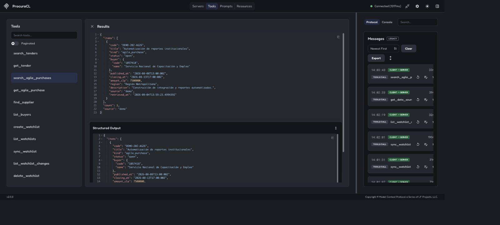
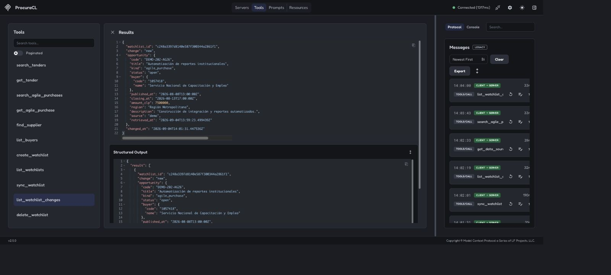
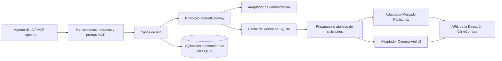
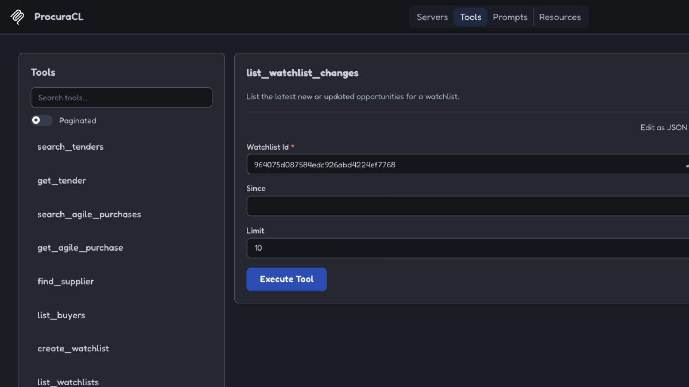

# ProcuraCL MCP

**Inteligencia de compras públicas de Chile mediante herramientas MCP estructuradas.**

[](https://github.com/EmersonDiazG/procuracl-mcp/actions/workflows/ci.yml)
[](https://www.python.org/)
[](LICENSE)

ProcuraCL permite que un agente de IA descubra y monitoree oportunidades de compra pública sin
obligar al usuario a conocer los contratos distintos de Mercado Público v1 y Compra Ágil v2. El
proyecto incluye un modo demostración sin credenciales y un modo real que utiliza un ticket personal
de ChileCompra.

> [!IMPORTANT]
> Este es un proyecto de portafolio independiente. No es desarrollado, patrocinado ni respaldado por
> la Dirección ChileCompra o Mercado Público. Los registros del modo demostración son sintéticos y
> siempre indican `source="demo"`.

## Demostración

La siguiente ejecución corresponde a ProcuraCL `0.3.0` en MCP Inspector. La consulta tipada encuentra
una oportunidad de Compra Ágil y conserva su comprador, monto, región, fechas, procedencia y momento
de recuperación.



Los mismos criterios pueden convertirse en una vigilancia persistente. La primera sincronización
registra una oportunidad nueva; una segunda ejecución idéntica la clasifica como sin cambios, en vez
de crear un duplicado.



Puedes reproducir el recorrido con el [guion de demostración de 90 segundos](docs/demo-script.md) y
revisar todas las pruebas visuales en la [galería de evidencias](docs/demo-evidence.md).

## Qué problema resuelve

- **Un solo contrato tipado:** licitaciones y compras ágiles se convierten al modelo común
  `Opportunity`.
- **Monitoreo persistente:** SQLite almacena vigilancias, instantáneas, sincronizaciones, caché y el
  presupuesto diario local de solicitudes.
- **Detección determinista de cambios:** la primera observación es `new`, una huella modificada es
  `updated` y un registro idéntico es `unchanged`.
- **Secretos fuera del protocolo:** el ticket se obtiene exclusivamente desde el entorno; nunca se
  recibe como argumento MCP ni se devuelve en una respuesta.
- **Integración resiliente:** Mercado Público v1 y Compra Ágil v2 están aislados detrás de adaptadores
  independientes y respuestas normalizadas.
- **Uso responsable de la cuota:** un acierto de caché no consume presupuesto y cada fallo de caché
  reserva una solicitud de forma atómica antes de contactar a ChileCompra.
- **Procedencia verificable:** cada resultado indica su fuente y la fecha en que fue recuperado.

## Arquitectura



La interfaz MCP no contiene reglas de negocio. Los modelos de dominio, casos de uso, adaptadores
externos y persistencia pueden probarse y reemplazarse de manera independiente. Consulta la
[arquitectura detallada](docs/architecture.md), el
[registro de decisión](docs/decisions/ADR-001-mcp-as-interface.md) y el
[modelo de amenazas](docs/threat-model.md).

## Superficie MCP

| Capacidad | Herramientas |
| --- | --- |
| Descubrimiento | `search_tenders`, `get_tender`, `search_agile_purchases`, `get_agile_purchase` |
| Actores del mercado | `find_supplier`, `list_buyers` |
| Monitoreo | `create_watchlist`, `list_watchlists`, `sync_watchlist`, `list_watchlist_changes`, `delete_watchlist` |
| Operación | `get_request_budget`, `get_data_source_status` |

Recursos: `procura://about` y `procura://watchlists`.

Prompt: `opportunity_brief`



## Inicio rápido en modo demostración

Requisitos: Python 3.12 o superior, Node.js/npm para MCP Inspector y `uv`.

```bash
git clone https://github.com/EmersonDiazG/procuracl-mcp.git
cd procuracl-mcp
python -m venv .venv
source .venv/bin/activate
python -m pip install -e ".[dev]"
pytest
mcp dev src/procura_cl/mcp/server.py --with-editable .
```

En Inspector, abre `search_agile_purchases` y ejecuta:

```json
{
  "query": "automatización",
  "status": "open",
  "region": "Región Metropolitana",
  "limit": 5
}
```

Luego prueba el monitoreo persistente:

1. Crea una vigilancia con `terms=["automatización", "integración", "software"]`,
   `kind="agile_purchases"`, `region="Región Metropolitana"` y `status="open"`.
2. Copia su `id` en `sync_watchlist`: se registrará una oportunidad nueva.
3. Sincroniza nuevamente: la misma oportunidad quedará como sin cambios y no se duplicará.
4. Ejecuta `list_watchlist_changes` para recuperar el historial persistente.

### Si Inspector no encuentra `uv`

Inicia Inspector desde el entorno virtual y confirma que ambos ejecutables estén disponibles:

```bash
source .venv/bin/activate
command -v npx
command -v uv
mcp dev src/procura_cl/mcp/server.py --with-editable .
```

## Conectar datos reales de Mercado Público

1. Solicita un ticket personal en el portal oficial de
   [APIs de ChileCompra](https://www.chilecompra.cl/api/).
2. Copia la plantilla segura:

   ```bash
   cp .env.example .env
   ```

3. Configura localmente estas variables. No publiques el ticket ni lo envíes como argumento de una
   herramienta:

   ```dotenv
   PROCURA_DATA_MODE=live
   CHILE_PUBLIC_MARKET_TICKET=tu-ticket-personal
   ```

4. Reinicia Inspector y ejecuta `get_data_source_status`. Debe informar `mode="live"`,
   `source="mercado_publico"` y `ticket_configured=true`.

Estados amigables como `open`, `closed` y `awarded` se normalizan a los valores oficiales de cada
API. El adaptador real fue probado de forma controlada contra ambos servicios oficiales; las pruebas
en vivo son opcionales para que la CI nunca consuma la cuota externa.

## Configuración

| Variable | Valor inicial | Propósito |
| --- | --- | --- |
| `PROCURA_DATA_MODE` | `demo` | Selecciona datos sintéticos (`demo`) o datos de API (`live`). |
| `CHILE_PUBLIC_MARKET_TICKET` | vacío | Ticket personal requerido únicamente en modo real. |
| `PROCURA_DATABASE_PATH` | `data/procura.db` | Base de datos SQLite persistente. |
| `PROCURA_DAILY_REQUEST_LIMIT` | `9500` | Corte local bajo el máximo oficial de 10.000 solicitudes diarias. |
| `PROCURA_CACHE_TTL_SECONDS` | `300` | Vigencia de la caché de lectura en segundos. |
| `PROCURA_API_TIMEOUT_SECONDS` | `30` | Tiempo máximo de espera externo, limitado entre 1 y 120 segundos. |

`.env`, `.venv`, los informes de cobertura y `data/` están excluidos por Git. El ticket no aparece en
las claves de caché, registros ni resultados MCP.

## Calidad y seguridad

El repositorio supera 24 pruebas automatizadas con 79 % de cobertura de sentencias, formato y
análisis de Ruff, mypy estricto, validación del lockfile y GitHub Actions.

```bash
ruff format --check src tests
ruff check src tests
mypy src
pytest --cov=procura_cl --cov-report=term-missing
uv lock --check
```

Además, el diseño incorpora límites de tiempo, presupuesto atómico, caché, deduplicación, separación
de secretos, procedencia explícita y un [modelo de amenazas](docs/threat-model.md).

## Ejecución y empaquetado

Ejecutar como servidor MCP estándar mediante `stdio`:

```bash
procura-cl-mcp
```

Construir y ejecutar con datos locales persistentes en Docker:

```bash
docker build -t procura-cl-mcp .
docker run --rm -i -v "$(pwd)/data:/app/data" procura-cl-mcp
```

## Hoja de ruta

1. Incorporar pruebas programadas y opcionales del modo real, con alertas ante cambios externos.
2. Agregar registros estructurados sin secretos, métricas y telemetría de caché.
3. Exponer los casos de uso mediante FastAPI y MCP Streamable HTTP con autorización.
4. Incorporar PostgreSQL para monitoreo multiusuario.
5. Agregar ranking determinista y evaluaciones de agentes después de observar el flujo real.

## Restricciones de uso de datos

ChileCompra documenta un ticket personal, un límite de 10.000 solicitudes diarias, posibles cambios
de servicio y atribución obligatoria al republicar información sin modificaciones. Por eso ProcuraCL
utiliza caché, deduplicación, métricas de cuota, procedencia explícita y la atribución
`Dirección ChileCompra` en los diagnósticos del modo real.

## Licencia

[MIT](LICENSE)
