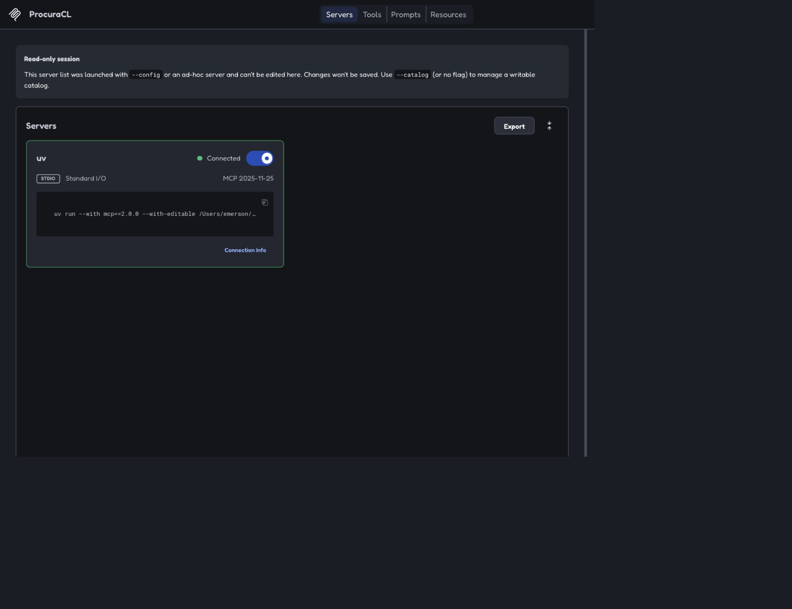
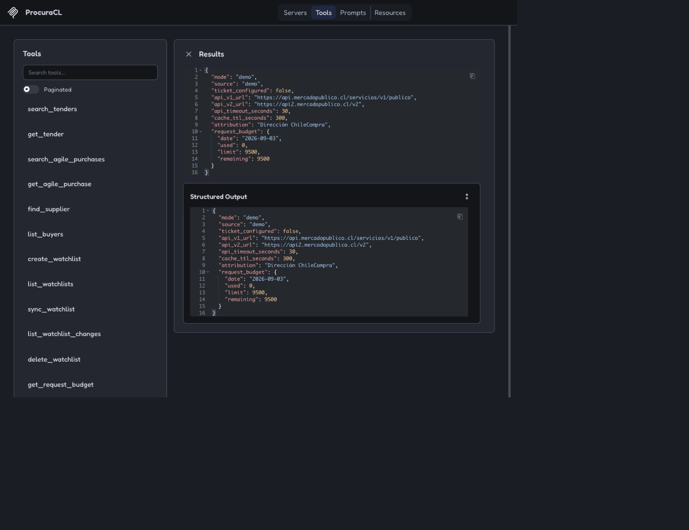
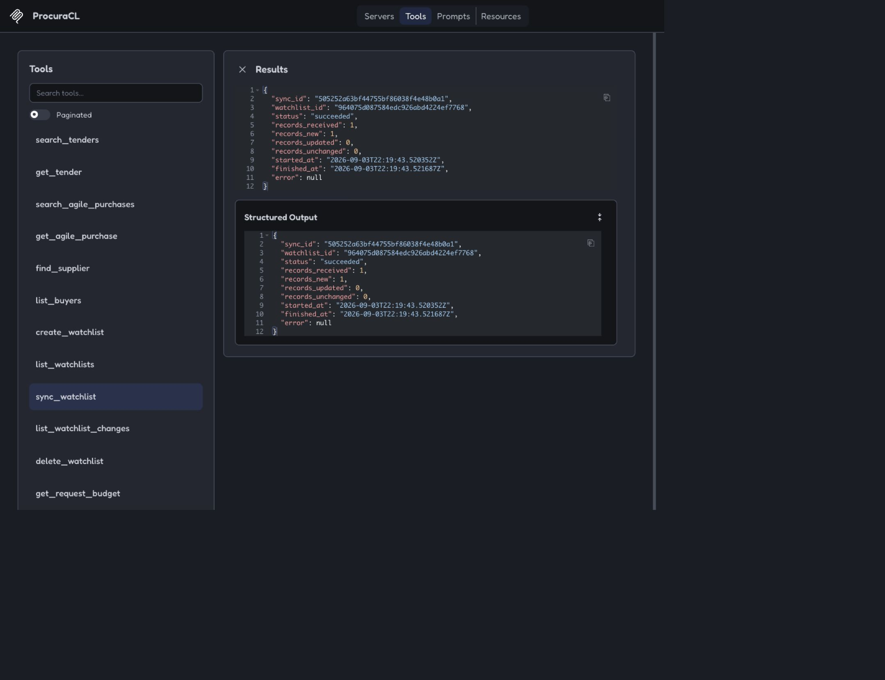
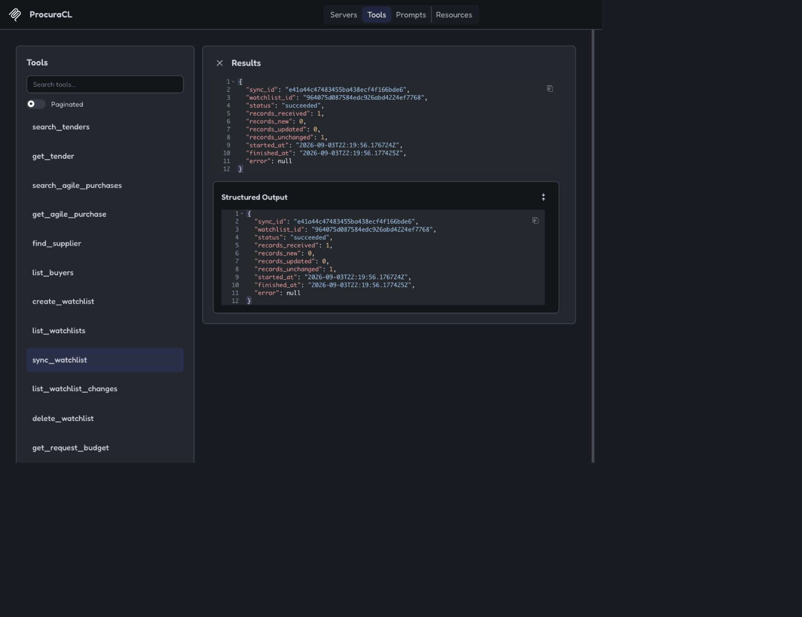

# Demo evidence — ProcuraCL 0.3.0

These screenshots document one complete MCP Inspector run in demo mode. Demo data is synthetic and
is explicitly labeled `source="demo"`.

## Server connected

## MCP tool catalog

## Data-source diagnostic

## Typed opportunity search

## First watchlist synchronization

## Idempotent second synchronization

## Persistent change history

